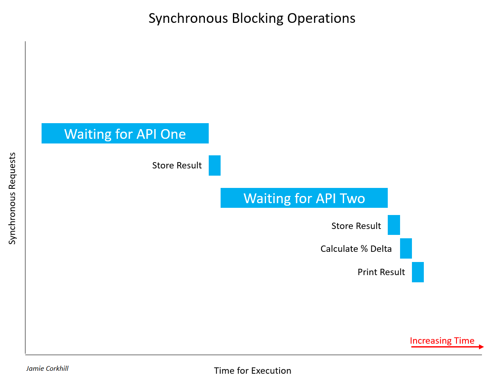

# Node-Article-One

You’ve probably heard of Node.js as being an “asynchronous JavaScript runtime built on Chrome’s V8 JavaScript engine”, and that it “uses an event-driven, non-blocking I/O model that makes it lightweight and efficient”. But for some, that is not the greatest of explanations. 

What exactly does it mean for Node to be “asynchronous”, and how does that differ from “synchronous”? What is Google Chrome’s V8 JavaScript Engine, and what is the meaning “event-driven” and “non-blocking” anyway?

We’ll attempt to answer all of these questions and more throughout this article as we build a simple Bookshelf API utilizing a variety of third-party NPM modules – including Express, Mongoose, and Lodash.

### What is Node.js
...
*Notes:* Node is only an enviroment, or runtime, within which to run normal JavaScript (with minor differences) outside of the browser.

### Blocking/Non-Blocking and Synchronous/Asynchronous

Suppose we are making a database call to retrieve properties about a user. That call is going to take time, and if the request is "blocking", then that means it will block the execution of our program until the call is complete. In this case, we made a “synchronous” request since it ended up blocking the thread.

So, a *synchronous* operation *blocks* a process or thread until that operation is complete, leaving the thread in a "wait state". An *asynchronous* operation, on the other hand, is *non-blocking*. It permits execution of the thread to proceed regardless of the time it takes for the operation to complete or the result it completes with, and no part of the thread falls into a wait state at any point.

Let's look at another example of a *synchronous* call that *blocks* a thread. Suppose we are building an application that compares the results of two Weather APIs to find their percent difference in temperature. In a blocking manner, we make a call to Weather API One and wait for the result. Once we get a result, we call Weather API Two and wait for its result. 



Allow me to note, it's important to recognize that not all synchronous calls are necessarily blocking. If a synchronous operation can manage to complete without blocking the thread or causing a wait state, it was non-blocking. Most of the time, synchronous calls will be blocking, and the time they take to complete will depend on a variety of factors, such as the speed of the API's servers, the end user's internet connection download speed, etc.

In the case of the image above, we had to wait quite a while to retrieve the first results from API One. Thereafter, we had to wait equally as long to get a response from API Two. While waiting for both responses, the user would notice our application hang, and this is bad for User Experience.

In the case of a non-blocking call, we'd have something like this:


You can clearly see how much faster we concluded execution. Rather than wait on API One and then wait on API Two, we could wait for both of them to complete at the same time, and achieve our results almost 50% faster. Notice, once we called API One and started waiting for its response, we also called API Two and began waiting for its response at the same time as One.

At this point, before moving into more concrete and tangible examples, it is important to mention that, for ease, the term *"Synchronous"* is generally shortened to "Sync", and the term *"Asynchronous"* is generally shortened to "Async". You will see this notation used in method/function names.

### Callback Functions

You might be wondering, "if we can handle a call asynchronously, how do we know when that call is finished and we have a response?" Generally, we pass in as an argument to our async method a callback function, and that method will "call back" that function at a later time with a response. I'm using ES5 functions here, but we'll update to ES6 standards later.

```javascript
function asyncAddFunction(a, b, callback){
  callback(a + b); //This callback is the one passed in to the function call below.
}

asyncAddFunction(2, 4, function(sum) {
  //Here we have the sum, 2 + 4 = 6.
});
```
Such a function is called a "Higher-Order Function" since it takes a function (our callback) as an argument. Alternatively, a callback function might take in an error object and a response object as arguments, and present them when the async function is complete. We'll see this later with Express. When we called `asyncAddFunction(...)`, you'll notice we supplied a callback function for the callback parameter from the method definition. This function is an *anonymous* function (it does not have a name) and is written using the *Expression Syntax*. The method definition, on the other hand, is a function statement. It's not anonymous because it actually has a name (that being "asyncAddFunction").

Some may note confusion since, in the method definition, we do supply a name, that being "callback". However, the anonymous function passed in as the third parameter to `asyncAddFunction(...)` does not know about the name, and so it remains anonymous. We also can't execute that function at a later point by name, we'd have to go through the async calling function again to fire it.

As an example of a synchronous call, we can use the Node.js `readFileSync(...)` method. Again, we'll be moving to ES6+ later.

```javascript
var fs = require('fs');
var data = fs.readFileSync('/example.txt'); // The thread will be blocked here until complete.
```
If we were doing this asynchronously, we'd pass in a callback function which would fire when the the async operation was complete.
```javascript
var fs = require('fs');
var data = fs.readFile('/example.txt', function(err, data){ //Move on, this will fire when ready.
  if(err) return console.log('Error: ', err);
  console.log('Data: ', data);
}); 
// Keep executing below, don't wait on the data.
```
If you have never seen `return` used in that manner before, we are just saying to stop function execution so we don't print the data object if the error object is defined. We could also have just wrapped the log statement in an `else` clause.

Like our `asyncAddFunction(...)`, the code behind the `fs.readFile(...)` function would be something along the lines of:

```javascript
function readFile(path, callback) {
 //Behind the scenes code to read a file stream.
 //Data is defined here.
 callback(undefined, data); //Or, callback(err, undefined);
}
```
Allow us to look at one last implementation of an async function call. This will help to solidify the idea of callback functions being fired at a later point in time, and it will help us to understand the execution of a typical Node.js program.

```javascript
setTimeout(function {
}, 1000);
```
The `setTimeout(...)` method takes a callback function for the first parameter which will be fired after the number of milliseconds specified as the second argument has occurred.

Let's look at a more complex example:
```javascript
console.log('Initiated program.');

setTimeout(function {
  console.log('3000 ms (3 sec) have passed.');
}, 3000);

setTimeout(function {
  console.log('0 ms (0 sec) have passed.');
}, 0);

setTimeout(function {
  console.log('1000 ms (1 sec) has passed.');
}, 1000);

console.log('Terminated program');
```
The output we receive is:
```
Initiated program.
Terminated program.
0 ms (0 sec) have passed.
1000 ms (1 sec) has passed.
3000 ms (3 sec) have passed.
```
You can see that the first log statement runs as expected. Instantaneously, the last log statement prints to the screen, for that happens before 0 seconds have surpassed after the second `setTimeout(...)`. Immediately thereafter, the second, third, and first `setTimeout(...)` methods execute.

If Node.js was not non-blocking, we'd see the first log statement, wait 3 seconds to see the next, instantaneously see the third (the 0-second `setTimeout(...)`, and then have to wait one more second to see the last two log statements. The non-blocking nature of Node makes all timers start counting down from the moment the program is executed, rather than the order in which they are typed.

It is important to note that just because you see a callback function does not necessarily mean there is an asynchronous call in the code. 
### Promises over Callbacks
Callbacks can quickly become messy in JavaScript, especially multiple nested callbacks. We are familiar with passing a callback as an argument to a function, but Promises allow us to tack, or attach, a callback to an object returned from a function. This would allow us to handle multiple async calls in a more elegant manner.

As an example, suppose we are making an API call, and our function, not so uniquely named '`makeAPICall(...)`', takes a URL and a callback.

Our function, `makeAPICall(...)`, would be defined as 

```javascript
function makeAPICall(path, callback) {
  // Attempt to make API call to path argument.
  // ...
  callback(undefined, res); // Or, callback(err, undefined);
}
```
and we would call it with:

```javascript
makeAPICall('/example', function(err1, res1) {
  if(err1) return console.log('Error: ', err1);
  // ... 
});
```

If we wanted to make another API call using the response from the first, we would have to nest both callbacks. Suppose I need to inject the `userName` property from the `res1` object into the path of the second API call. We would have:

```javascript
makeAPICall('/example', function(err1, res1) {
  if(err1) return console.log('Error: ', err1);
  makeAPICall('/newExample/' + res1.userName, function(err2, res2) {
    if(err2) return console.log('Error: ', err2);
    console.log(res2);
  });
});
```
*Note: The ES6+ method to inject the `res1.userName` property rather than string concatenation would be to use "Template Strings". That way, rather than encapsulate our string in quotes (', or "), we would use backticks (\`), located beneath the Escape key on your keyboard. Then, we would use the notation `${}` to embed any JS expression inside the brackets. In the end, our earlier path would be: `/newExample/${res.UserName}`, wrapped in backticks.*

It is clear to see that this method of nesting callbacks can quickly become quite inelegant, so-called the "JavaScript Pyramid of Doom". Jumping in, if we were using promises rather than callbacks, we could refactor our code from the first example as such:

```javascript
makeAPICall('/example').then(function(res) { // Success callback.
  // ...
}, function(err) { // Failure callback.
  console.log('Error:', err);
});
```
The first argument to the `then()` function is our success callback, and the second argument is our failure callback. Alternatively, we could lose the second argument to `.then()`, and call `.catch()` instead. Arguments to `.then()` are optional, and calling `.catch()` would be equivalent to `.then(successCallback, null)`.

Using `.catch()`, we have:

```javascript
makeAPICall('/example').then(function(res) { // Success callback.
  // ...
}).catch(function(err) {  // Failure Callback
  console.log('Error: ', err);
});
```
We can also restructure this for readability:

```javascript
makeAPICall('/example')
  .then(function(res) {
    // ...
  })
  .catch(function(err) {
    console.log('Error: ', err);
  });
```
It is important to note that we can't just tack a `.then()` call on to any function and expect it to work. The function we are calling has to actually return a promise, a promise that will fire the `.then()` when that async operation is complete. In this case, `makeAPICall(...)` will do it's thing, firing either the `then()` block or the `catch()` block when completed.

To make `makeAPICall(...)` return a Promise, we assign a function to a variable, where that function is the Promise constructor. Promises can be either *fulfilled* or *rejected*, where fulfilled means that action relating to the promise completed successfully, and rejected meaning the opposite. Once the promise is either fulfilled or rejected, we say it has *settled*, and while waiting for it to settle, perhaps during an async call, we say that the promise is *pending*. 

The Promise constructor takes in one callback function as an argument, which receives two parameters - `resolve` and `reject`, which we will call at a later point in time to fire either the success callback in `.then()`, or the `.then()` failure callback, or `.catch()`, if provided.

Here is an example of what this looks like:

```javascript
var examplePromise = new Promise(function(resolve, reject) {
  // Do whatever we are going to do and then make the appropiate call below:
  resolve('Happy!'); // - Everything worked.
  reject('Sad!'); // - We noticed that something went wrong.
}):
```
Then, we can use:
```javascript
examplePromise.then(/* Both callback functions in here */);
```

Notice, however, that `examplePromise` can't take any arguments. That kind of defeats the purpose, so we can return a promise instead.

```javascript
function makeAPICall(path) {
  return new Promise(function(resolve, reject) {
    // Make our async API call here.
    if (/* All is good */) return resolve(res); //res is the response, would be defined above.
    else return reject(err); //err is error, would be defined above.
  });
}
```
Promises really shine to improve the structure, and subsequently, elegance, of our code with the concept of "Promise Chaining". This would allow us to return a new Promise inside a `.then()` clause, so we could attach a second `.then()` thereafter, which would fire the appropriate callback from the second promise.

Refactoring our multi API URL call above with Promises, we get:

```javascript
makeAPICall('/example').then(function(res) { // First response callback. Fires on success to '/example' call.
  return makeAPICall(`/newExample/${res.UserName}`); // Returning new call allows for Prmoise Chaining.
}, function(err) { // First failure callback. Fires if there is a failure calling with '/example'.
  console.log('Error:', err);
}).then(function(res) { // Second response callback. Fires on success to returned '/newExample/...' call.
  console.log(res);
}, function(err) { // Second failure callback. Fire if there is a failure calling with '/newExample/...'
  console.log('Error:', err);
});
```
Noteice that we first call `makeAPICall('/example')`. That returns a promise, and so we attach a `.then()`. Inside that `then()`, we return a new call to `makeAPICall(...)`, which, in and of itself, as seen earlier, returns a promise, permitting us chain on a new `.then()` after the first.

Like above, we can restructure this for readability, and remove the failure callbacks for a generic `catch()` all clause. Then, we can follow the DRY Principle (Don't Repeat Yourself), and only have to implement error handling once.
```javascript
makeAPICall('/example')
  .then(function(res) { // Like earlier, fires with success and response from '/example'.
    return makeAPICall(`/newExample/${res.UserName}`); // Returning here lets us chain on a new .then(). 
   })
  .then(function(res) { // Like earlier, fires with success and response from '/newExample'.
    console.log(res);
   })
  .catch(function(err) { // Generic catch all method. Fires if there is an err with either earlier call.
    console.log('Error: ', err);
   });
```
### ES6 Const vs. Let
Throughout all of our examples, we have been employing ES5 functions and the old `var` keyword. While millions of lines of code still run today employing those ES5 methods, it is useful to update to current ES6+ standards, and we'll refactor some of our code above. Let's start with `const` and `let`.

You might be used to declaring a variable with the `var` keyword:

```javascript
var pi = 3.14;
```
With ES6+ standards, we could make that either
```javascript
let pi = 3.14;
```
or
```javascript
const pi = 3.14;
```
where `const` means "constant" - a value that cannot be reassigned to later. (Except for object properties - we'll cover that soon. Also, variables declared `const` are *not* immutable, only the reference to the variable is.)

In old JavaScript, block scopes, such as those in `if`, `while`, `{}`. `for`, etc. did not affect `var` in any way, and this is quite different to more statically typed languages like Java or C++. That is, the scope of `var` is the entire enclosing function - and that could be global (if placed outside a function), or local (if placed within a function). To demonstrate this, see the following example:

```javascript
function myFunction() {
  var num = 5;
  console.log(num); // 5
  for(var i = 0; i < 10; i++)
  {
    var num = i;
    console.log('--');
    console.log(num); //num becomes 0 - 9
  }
  console.log('--');
  console.log(num); // 9
  console.log(i); // 10
}
```
The important thing to notice here is that defining a new `var num` inside the `for` scope directly affected the `var num` outside and above the `for`. This is because `var`'s scope is always that of the enclosing function, and not a block.

Again, by default, `var i` inside `for()` defaults to `myFunction`'s scope, and so we can access `i` outside the loop and get 10.

In terms of assigning values to variables, `let` is equivalent to `var`, it's just that `let` has block scoping, and so the anomalies that occurred with `var` above will not happen.

```javascript
function myFunction() {
  let num = 5;
  console.log(num); // 5
  for(let i = 0; i < 10; i++)
  {
    let num = i;
    console.log('--');
    console.log(num); //num becomes 0 - 9
  }
  console.log('--');
  console.log(num); // 5
  console.log(i); // undefined, ReferenceError
}
```
Looking at the `const` keyword, you can see that we attain an error if we try to reasign to it:
```javascript
const c = 299792458;
c = 10; //TypeError: Assignment to constant variable. 
```
Things become interesting when we assign a `const` variable to an object:
```javascript
const myObject = {
  name: 'Jane Doe'
};

// This is illegal: TypeError: Assignment to constant variable.
myObject = { 
  name: 'John Doe'
};

// This is legal. console.log(myObject.name) -> John Doe
myObject.name = 'John Doe';
```
As you can see, only the reference in memory to the object assigned to a `const` object is immutable, not the value its self.

### ES6 Arrow Functions
You might be used to creating a function like this:

```javascript
function printHelloWorld() {
  console.log('Hello, World!');
}
```
With arrow functions, that would become:

```javascript
const printHelloWorld = () => {
  console.log('Hello, World!');
};
```
Suppose we have a simple function that returns the square of a number:

```javascript
const squareNumber = (x) => {
  return x * x;
}

squareNumber(5); // We can call an arrow function like an ES5 functions. Returns 25.
```
You can see that, just like with ES5 functions, we can take in arguments with parentheses, we can use normal return statements, and we can call the function just like any other.

It's important to note that, while parentheses are required if our function takes no arguments (like with `printHelloWorld()` above), we can drop the parentheses if it only takes one, so our earlier `squareNumber()` method definition can be rewritten as:

```javascript
const squareNumber = x => { // Notice we have dropped the parentheses for we only take in one argument.
  return x * x;
}
```
Whether you choose to encapsulate a single argument in parentheses or not is a matter of personal taste, and you will likely see developers use both methods.

Finally, if we only want to implicitly return one expression, as with `squareNumber(...)` above, we can put the return statement in line with the method signature:

```javascript
const squareNumber = x => x * x;
```
That is, 

```javascript
const test = (a, b, c) => expression 
```
is the same as

```javascript
const test = (a, b, c) => { return expression }
```
Note, when using the above shorthand to implicitly return an object, things become obscure. What stops JavaScript from believing the brackets within which we are required to encapsulate our object is not our function body? To get around this, we wrap the object's brackets in parentheses. This explicitly lets JavaScript know that we are indeed returning an object, and we are not just defining a body.

```javascript
const test = () => ({pi: 3.14});
```

To help solidify the concept of ES6 functions, we'll refactor some of our earlier code allowing us to compare the differences between both notations.

`asyncAddFunction(...)`, from above, could be refactored from:
 
```javascript
function asyncAddFunction(a, b, callback){
  callback(a + b); 
}
```
to:
```javascript
const aysncAddFunction = (a, b, callback) => {
  callback(a + b);
};
```
or even to:
```javascript
const aysncAddFunction = (a, b, callback) => callback(a + b); // This will return callback(a + b).
```
When calling the function, we could pass an arrow function in for the callback:

```javascript
asyncAddFunction(10, 12, sum => { // No parentheses cause we only take one argument.
  console.log(sum);
}
```

It is clear to see how this method improves code readability. To show you just one case, we can take our old ES5 Promise based example above, and refactor it to use arrow functions.

```javascript
makeAPICall('/example')
  .then(res => makeAPICall(`/newExample/${res.UserName}`))
  .then(res => console.log(res))
  .catch(err => console.log('Error: ', err));
```
Now, there are some caveats with arrow functions. For one, they do not bind a `this` keyword. Suppose I have the following object:

```javascript
const Person = {
  name: 'John Doe',
  greeting: () => {
    console.log(`Hi. My name is ${this.name}.`);
  }
}
```
You might expect a call to `Person.greeting()` will return 'Hi. My name is John Doe.' Instead, we get: 'Hi. My name is undefined.'. That is because arrow functions do not have a `this`, and so attempting to use `this` inside an arrow function defaults to the `this` of the enclosing scope, and the enclosing scope of the `Person` object is `window`, in the browser, or `module.exports` in Node.

To prove this, if we use the same object again, but set the `name` property of the global `this` to something like 'Jane Doe', then `this.name` in the arrow function returns 'Jane Doe', because the global `this` is within the enclosing scope, or is the parent of the `Person` object.

```javascript
this.name = 'Jane Doe';

const Person = {
  name: 'John Doe',
  greeting: () => {
    console.log(`Hi. My name is ${this.name}.`);
  }
}

Person.greeting(); // Hi. My name is Jane Doe
```
This is known as 'Lexical Scoping', and we can get around it by using the so-called 'Short Syntax', which is where we lose the colon and the arrow as to refactor our object as such:

```javascript
const Person = {
  name: 'John Doe',
  greeting() {
    console.log(`Hi. My name is ${this.name}.`);
  }
}

Person.greeting() //Hi. My name is John Doe.
```
### (Optional) Javascript Classes & `this` Binding
...
### APIs & JSON
APIs are a very common paradigm in programming, and even if you are just starting out in your career as a developer, APIs and their usage, especially in web and mobile development, will likely come up more often than not.

An API is an *Application Programming Interface*, and it is basically a method by which two decoupled systems may communicate with each other. In more technical terms, an API permits a system or computer program (usually a server) to receive requests and send appropriate responses (to a client, also known as a host).

Suppose you are building a weather application. You need a way to geocode a user's address into a latitude and longitude, and then a way to attain the current or forecasted weather at that particular location.

As a developer, you want to focus on building your app and monetizing it, not putting the infrastructure in place to geocode addresses or placing weather stations in every city.

Luckily for you, companies like Google and OpenWeatherMap have already put that infrastructure in place, you just need a way to talk to it - that is where the API comes in. While, as of now, we have developed a very abstract and ambiguous definition of the API, bear with me. We'll be getting to tangible examples soon.

Now, it costs money for companies to develop, maintain, and secure that aforementioned infrastructure, and so it is common for corporations to sell you access to their API. This is done with that is known as an API key, a unique alphanumeric identifier associating you, the developer, with the API. Every time you ask the API to send you data, you pass along your API key. The server can then authenticate you and keep track of how many API calls you are making, and you will be charged appropriately. The API key also permits *Rate-Limiting* or *API Call Throttling* (a method of throttling the number of API calls in a certain timeframe as to not overwhelm the server, preventing DOS attacks - Denial of Service). Most companies, however, will provide a free quota, giving you, as an example, 25000 free API calls a day before charging you.

Up to this point, we have established that an API is a method by which two computer programs can communicate with each other. If a server is storing data, such as a website, and your browser makes a request to download the code for that site, that was the API in action.

Let us look at a more tangible example, and then we'll look at a more real-world, technical one. Suppose you are eating out at a restaurant for dinner. You are equivalent to the client, sitting at the table. The chefs in the kitchen, however, are the server.

Since you will never directly talk to the chef, there is no way for him/her to receive your request (for what order you would like to make) or for him/her to provide you with your meal once you order it. We need someone in the middle. In this case, it's the waiter, analogous to the API. The API provides a medium with which you (the client) may talk to the server (the chef), as well as a set of rules for how that communication should be made (the menu - one meal is allowed two sides, etc.)

Now, how do you actually talk to the API (the waiter)? You might speak English, but the chef might speak Spanish. Is the waiter expected to know both languages to translate? What if a third person comes in who only speaks Indian? What then? Well, all clients and servers have to agree to speak a common language, and in computer programming, that language is JSON, pronounced JAY-sun, and it stands for JavaScript Object Notation.

At this point, we don't quite know what JSON looks like. It's not a computer programming language, it's just, well, a language, like English or Spanish, that everyone (everyone being computers) understands on a guaranteed basis. It's guaranteed because it's a standard, notably *RFC 8259*, the *JavaScript Object Notation (JSON) Data Interchange Format* by the Internet Engineering Task Force (IETF).

Even without formal knowledge of what JSON actually is and what it looks like (we'll see in an upcoming article in this series), we can go ahead introduce a technical example operating on the Internet today that employs APIs and JSON. APIs and JSON are not just something you can choose to use, it's not equivalent to one out of a thousand JavaScript frameworks you can pick to do the same thing. It is *THE* standard for data exchange on the web.

Suppose you are building a travel website that compares prices for aircraft, rental car, and hotel ticket prices. Let us walk through, step-by-step, on a high level, how we would build such an application. Of course, we need our User Interface, the front-end, but that is out of scope for this article.

We want to provide our users with the lowest price booking method. Well, that means we need to somehow attain all possible booking prices, and then compare all of the elements in that set (perhaps we store them in an array) to find the smallest element (known as the infimum in mathematics.)

How will we get this data? Well, suppose all of the booking sites have a database full of prices. Those sites will provide an API, which exposes the data in those databases for use by you. You will call each API for each site to attain all possible booking prices, store them in your own array, find the lowest or minimum element of that array, and then provide the price and booking link to your user. We'll ask the API to query its database for the price in JSON, and it will respond with said price in JSON to us. We can then use, or parse, that accordingly. We have to parse it because APIs will return JSON as a string, not the actual JavaScript data type of JSON. This might not make sense now, and that's okay. We'll be covering it more in a future article.

Also, note that just because something is called an API does not necessarily mean it operates on the web and sends and receives JSON. The Java API, for example, is just the list of classes, packages, and interfaces that are part of the Java Development Kit (JDK), providing programming functionality to the programmer.

Okay. We know we can talk to a program running on a server by way of an Application Programming Interface, and we know that the common language with which we do this is known as JSON. But in the web development and networking world, everything has a protocol. What do we actually do to make an API call, and what does that look like code-wise? That's where HTTP Requests enter the picture, the HyperText Transfer Protocol, defining how messages are formatted and transmitted across the Internet. Once we have an understanding of HTTP (and HTTP verbs, you'll see that in the next section), we can look into actual JavaScript frameworks and methods (like `fetch()`) offered by the *JavaScript API* (similar to the Java API), that actually allow us to make API calls. 

### HTTP and HTTP Requests
HTTP is the HyperText Transfer Protocol. It is the underlying protocol that determines how messages are formatted as they are transmitted and received across the web. Let's think about what happens when, for example, you attempt to load the home page of Smashing Magazine in your web browser.

You type the website URL (Uniform Resource Locator) in the URL bar, where the DNS server (Domain Name Server, out of scope for this article) resolves the URL into the appropriate IP Address. The browser makes a request, called a GET Request, to the Web Server to, well, GET the underlying HTML behind the site. The Web Server will respond with a message such as "OK", and then will go ahead and send the HTML down to the browser where it will be parsed and rendered accordingly.

There are a few things to note here. First, the GET Request, and then the "OK" response. Suppose you have a specific database, and you want to write an API to expose that database to your users. Suppose the database contained books the user wants to read. Then there are four fundamental operations your user may want to perform on this database, that is, Create a record, Read a record, Update a record, or Delete a record, known collectively as CRUD operations.

Let's look at the Read operation for a moment. Without incorrectly assimilating or conflating the notion of a web server and a database, that Read operation is very similar to your web browser attempting to *get* the site from the server, just as to read a record is to *get* the record from the database.

This is known as an HTTP Request. You are making a request to some server somewhere to *get* some data, and, as such, the request is appropriately named "GET", capitalization being a standard way to denote such requests.

What about the Create portion of CRUD? Well, when talking about HTTP Requests, that is known as a POST request. Just as you might *post* a message on a social media platform, you might also *post* a new record to a database. Another such option is PUT, *putting* a new record in the database.

CRUD's Update allows us to use either PUT or PATCH. You may be wondering, "You just said that PUT can be used to create a resource. Why then are you saying it can also be used to update a resource?" Well, HTTP's PUT will either create a new record or will update/replace the old one.

Let's look at this a bit more in detail, and then we'll get to PATCH.

An API generally works by making HTTP requests to specific routes, in a URL. Suppose we are making an API to store a user's booklist. Then we might be able to view those books at the URL `.../books`. A POST requests to `.../books` will create a new book with whatever properties you define (think id, title, ISBN, author, publishing data, etc.) at the `.../books` route. It doesn't matter what the underlying data structure is that stores all the books at `.../books` right now. We just care that the API exposes that endpoint (accessed through the route) to manipulate data. The prior sentence was key: A POST request CREATES a new book at the `...books/` route. The difference between PUT and POST, then, is that PUT will create a new book (as with POST) if no such book exists, *or, it will replace an existing book* if the book already exists within that aforementioned data structure.

Suppose each book has the following properties: id, title, ISBN, author, hasRead (boolean).

Then to add a new book, as seen earlier, we would make a POST request to `.../books`. If we wanted to completely update or replace a book, we would make a PUT request to `.../books/id` where `id` is the ID of the book we want to replace.

While PUT completely replaces an existing book, PATCH updates something having to do with a specific book, perhaps modifying the `hasRead` boolean property we defined above.

It can be difficult to see the meaning of this right now, for thus far, we've established everything in theory but haven't seen any tangible code that actually makes an HTTP request. We shall, however, get to that soon.

There is one last fundamental CRUD operation and it's called Delete. As you would expect, the name of such an HTTP Request is "DELETE", and it works much the same as PATCH, requiring the book's ID be provided in a route.

We have learned thus far, then, that routes are specific URLs to which you make an HTTP Request, and that endpoints are functions the API provides, doing something to the data it exposes. That is, the endpoint is a programming language function located on the other end of the route, and it performs whatever HTTP Request you specified. We also learned that there exist such terms as POST, GET, PUT, PATCH, DELETE, and more (known as HTTP verbs) that actually specify what requests you are making to the API. Like JSON, these HTTP Request Methods are Internet standards as defined by the Internet Engineering Task Force (IETF), most notably, [RFC 7231, Section Four: Request Methods](https://tools.ietf.org/html/rfc7231#section-4), and [RFC 5789, Section Two: Patch Method](https://tools.ietf.org/html/rfc5789#section-2), where RFC is an acronym for Request for Comments.

So, we might make a GET request to the URL `.../books/id` where the ID passed in is known as a parameter. We could make a POST, PUT, or PATCH request to `.../books` to create a resource or to `.../books/id` to modify/replace/update a resource. And we can also make a DELETE request to `.../books/id` to delete a specific book.

A full list of HTTP Request Methods can be found here: https://developer.mozilla.org/en-US/docs/Web/HTTP/Methods

It is also important to note that after making an HTTP Request, we'll receive a response. The specific response is determined by how we build the API, but you should always receive a status code. Earlier, we said that when your web browser requests the HTML from the web server, it'll respond with "OK". That is known as an HTTP Status Code, more specifically, HTTP 200 OK. The status code just specifies how the operation or action specified in the endpoint (remember, that's our function that does all the work) completed. HTTP Status Codes are sent back by the server, and there are probably many you are familiar with, such as 404 Not Found (the resource or file could not be found, this would be like making a GET request to `.../books/id` where no such ID exists.) 

A complete list of HTTP Status Codes can be found here: https://httpstatuses.com/

### Node APIs, the Callstack, and the Event Loop
...
### JavaScript Events
...
### The Node Package Manager
When programming with Node and JavaScript, it'll be quite common to here about `npm`. Npm is a package manager which does just that - permits the downloading of third-party packages that solve common problems in JavaScript. Other solutions, such as Yarn, Npx, Grunt, and Bower exist as well, and in this section, we'll talk about what they are, what their differences are, and how you can install dependencies for your application through a simmple Command Line Interface (CLI) using them. We'll also mention their respective configurations by setting up the dependencies of the Command Line Application we'll be building in the second to last section to actually see how to make API Requests in Node.
### MongoDB 
...
### Building a Command Line Node Application
When building out an application, you will see many authors dump their entire code base at the beginning of the article, and then attempt to explain each line thereafter. In this text, I'll take a different approach. I'll explain my code line-by-line, building the app as we go. I won't worry about modularity or performance, I won't split the codebase into seperate files, and I won't follow the DRY Principle or attempt to make the code reusable. When just learning, it is useful to make things as simple as possible, and so that is the approach I will take here.

If you want to see the finished code, visit the GitHub Repository HERE.

If you want to see the refactored version of the code making use of some of the properties in the former paragraph, vist THIS GitHub Respository.

Let us be clear about what we are building. We won't be concerned with user input, and so we won't make use of packages like [Yargs](https://www.npmjs.com/package/yargs). We also won't be buillding our own API. That will come in a later article in this series when we make use of the Express Web Application Framework. I take this approach as to not conflate Node.js with the power of Express and APIs, since most tutorials do. Rather, I'll provide two methods (of many) by which to call and recieve data from an external API, the first of which utilizes a third-party JavaScript library, and another which uses a native JavaScript method. The API we'll be calling is a Weather API, which we'll call from Node and dump its output to the terminal, perhaps with some formatting, known as "pretty-printing". I'll cover the entire process, including how to set up the API and attain API Key, the steps of which provide the correct results as of January 2019.

We'll be using the OpenWeatherMap API for this project, so to get started, navigate to https://home.openweathermap.org/users/sign_up and create an account with the form. Once logged in, find the API Keys menu item on the dashboard page, located at https://home.openweathermap.org/api_keys. If you just created an account, you'll have to pick a name for your API Key and hit "Generate". It could take at least 2 hours for your new API Key to be functional and associated with your account.

Before we start building out the application, we'll vist the API Documentation (https://openweathermap.org/current) to learn how to format our API Key. In this project, we'll be specifiying a zip code and a country code to attain the weather information at that location.


### Conclusion
...

