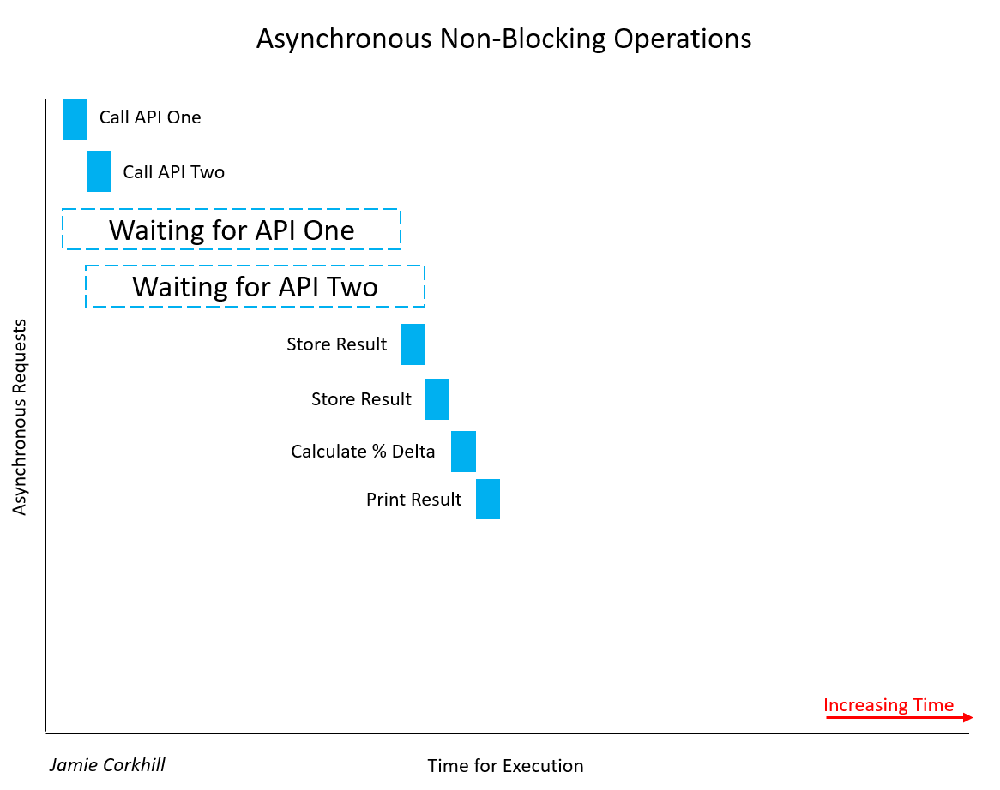

# Node-Article-One

You’ve probably heard of Node.js as being an “asynchronous JavaScript runtime built on Chrome’s V8 JavaScript engine”, and that it “uses an event-driven, non-blocking I/O model that makes it lightweight and efficient”. But for some, that is not the greatest of explanations. 

What exactly does it mean for Node to be “asynchronous”, and how does that differ from “synchronous”? What is Google Chrome’s V8 JavaScript Engine, and what is the meaning “event-driven” and “non-blocking” anyway?

We’ll attempt to answer all of these questions and more throughout this article as we build a simple Bookshelf API utilizing a variety of third-party NPM modules – including Express, Mongoose, and Lodash.

### Blocking/Non-Blocking and Synchronous/Asynchronous

Suppose we are making a database call to retrieve properties about a user. That call is going to take time, and if the request is "blocking", then that means it will block the execution of our program until the call is complete. In this case, we made a “synchronous” request since it ended up blocking the thread.

So, a *synchronous* operation *blocks* a process or thread until that operation is complete, leaving the thread in a "wait state". An *asynchronous* operation, on the other hand, is *non-blocking*. It permits execution of the thread to proceed regardless of the time it takes for the operation to complete or the result it completes with, and no part of the thread falls into a wait state at any point.

Let's look at another example of a *synchronous* call that *blocks* a thread. Suppose we are building an application that compares the results of two Weather APIs to find their percent difference in temperature. In a blocking manner, we make a call to Weather API One and wait for the result. Once we get a result, we call Weather API Two and wait for its result. 


Allow me to note, it's important to recognize that not all synchronous calls are necessarily blocking. If a synchronous operation can manage to complete without blocking the thread or causing a wait state, it was non-blocking. Most of the time, synchronous calls will be blocking, and the time they take to complete will depend on a variety of factors, such as the speed of the API's servers, the end user's internet connection download speed, etc.

In the case of the image above, we had to wait quite a while to retrieve the first results from API One. Thereafter, we had to wait equally as long to get a response from API Two. While waiting for both responses, the user would notice our application hang, and this is bad for User Experience.

In the case of a non-blocking call, we'd have something like this:



You can clearly see how much faster we concluded execution. Rather than wait on API One and then wait on API Two, we could wait for both of them to complete at the same time, and achieve our results almost 50% faster. Notice, once we called API One and started waiting for its response, we also called API Two and began waiting for its response at the same time as One.

At this point, before moving into more concrete and tangible examples, it is important to mention that, for ease, the term *"Synchronous"* is generally shortened to "Sync", and the term *"Asynchronous"* is generally shortened to "Async". You will see this notation used in method/function names.

### Callback Functions

You might be wondering, "if we can handle a call asynchronously, how do we know when that call is finished and we have a response?" Generally, we pass in as an argument to our async method a callback function, and that method will "call back" that function at a later time with a response. I'm using ES5 functions here, but we'll update to ES6 standards later.

```javascript
function asyncAddFunction(a, b, callback){
  callback(a + b); //This callback is the one passed in to the function call below.
}

asyncAddFunction(2, 4, function(sum) {
  //Here we have the sum, 2 + 4 = 6.
});
```
Alternatively, a callback function might take in an error object and a response object as arguments, and present them when the async function is complete. We'll see this later with Express. When we called `asyncAddFunction(...)`, you'll notice we supplied a callback function for the callback parameter from the method definition. This function is an *anonymous* function (it does not have a name) and is written using the *Expression Syntax*. The method definition, on the other hand, is a function statement. It's not anonymous because it actually has a name (that being "asyncAddFunction").

Some may note confusion since, in the method definition, we do supply a name, that being "callback". However, the anonymous function passed in as the third parameter to `asyncAddFunction(...)` does not know about the name, and so it remains anonymous. We also can't execute that function at a later point by name, we'd have to go through the async calling function again to fire it.

As an example of a synchronous call, we can use the Node.js `readFileSync(...)` method. Again, we'll be moving to ES6+ later.

```javascript
var fs = require('fs');
var data = fs.readFileSync('/example.txt'); // The thread will be blocked here until complete.
```
If we were doing this asynchronously, we'd pass in a callback function which would fire when the the async operation was complete.
```javascript
var fs = require('fs');
var data = fs.readFile('/example.txt', function(err, data){ //Move on, this will fire when ready.
  if(err) return console.log('Error: ', err);
  console.log('Data: ', data);
}); 
// Keep executing below, don't wait on the data.
```
If you have never seen `return` used in that manner before, we are just saying to stop function execution so we don't print the data object if the error object is defined. We could also have just wrapped the log statement in an `else` clause.

Like our `asyncAddFunction(...)`, the code behind the `fs.readFile(...)` function would be something along the lines of:

```javascript
function readFile(path, callback) {
 //Behind the scenes code to read a file stream.
 //Data is defined here.
 callback(undefined, data); //Or, callback(err, undefined);
}
```
Allow us to look at one last implementation of an async function call. This will help to solidify the idea of callback functions being fired at a later point in time, and it will help us to understand the execution of a typical Node.js program.

```javascript
setTimeout(function {
}, 1000);
```
The `setTimeout(...)` method takes a callback function for the first parameter which will be fired after the number of milliseconds specified as the second argument has occurred.

Let's look at a more complex example:
```javascript
console.log('Initiated program.');

setTimeout(function {
  console.log('3000 ms (3 sec) have passed.');
}, 3000);

setTimeout(function {
  console.log('0 ms (0 sec) have passed.');
}, 0);

setTimeout(function {
  console.log('1000 ms (1 sec) has passed.');
}, 1000);

console.log('Terminated program');
```
The output we receive is:
```
Initiated program.
Terminated program.
0 ms (0 sec) have passed.
1000 ms (1 sec) has passed.
3000 ms (3 sec) have passed.
```
You can see that the first log statement runs as expected. Instantaneously, the last log statement prints to the screen, for that happens before 0 seconds have surpassed after the second `setTimeout(...)`. Immediately thereafter, the second, third, and first `setTimeout(...)` methods execute.

If Node.js was not non-blocking, we'd see the first log statement, wait 3 seconds to see the next, instantaneously see the third (the 0-second `setTimeout(...)`, and then have to wait one more second to see the last two log statements. The non-blocking nature of Node makes all timers start counting down from the moment the program is executed, rather than the order in which they are typed.

It is important to note that just because you see a callback function does not necessarily mean there is an asynchronous call in the code. 
### Promises over Callbacks
Callbacks can quickly become messy in JavaScript, especially multiple nested callbacks. We are familiar with passing a callback as an argument to a function, but Promises allow us to tack, or attach, a callback to an object returned from a function. This would allow us to handle multiple async calls in a more elegant manner.

As an example, suppose we are making an API call, and our function, not so uniquely named '`makeAPICall(...)`', takes a URL and a callback.

Our function, `makeAPICall(...)`, would be defined as 

```javascript
function makeAPICall(path, callback) {
  // Attempt to make API call to path argument.
  // ...
  callback(undefined, res); // Or, callback(err, undefined);
}
```
and we would call it with:

```javascript
makeAPICall('/example', function(err1, res1) {
  if(err1) return console.log('Error: ', err1);
  // ... 
});
```

If we wanted to make another API call using the response from the first, we would have to nest both callbacks. Suppose I need to inject the `userName` property from the `res1` object into the path of the second API call. We would have:

```javascript
makeAPICall('/example', function(err1, res1) {
  if(err1) return console.log('Error: ', err1);
  makeAPICall('/newExample/' + res1.userName, function(err2, res2) {
    if(err2) return console.log('Error: ', err2);
    console.log(res2);
  });
});
```
*Note: The ES6+ method to inject the `res1.userName` property rather than string concatenation would be to use "Template Strings". That way, rather than encapsulate our string in quotes (', or "), we would use backticks (\`), located beneath the Escape key on your keyboard. Then, we would use the notation `${}` to embed any JS expression inside the brackets. In the end, our earlier path would be: `/newExample/${res.UserName}`, wrapped in backticks.*

It is clear to see that this method of nesting callbacks can quickly become quite inelegant, so-called the "JavaScript Pyramid of Doom". Jumping in, if we were using promises rather than callbacks, we could refactor our code from the first example as such:

```javascript
makeAPICall('/example').then(function(res) { // Success callback.
  // ...
}, function(err) { // Failure callback.
  console.log('Error:', err);
});
```
The first argument to the `then()` function is our success callback, and the second argument is our failure callback. Alternatively, we could lose the second argument to `.then()`, and call `.catch()` instead. Arguments to `.then()` are optional, and calling `.catch()` would be equivalent to `.then(successCallback, null)`.

Using `.catch()`, we have:

```javascript
makeAPICall('/example').then(function(res) { // Success callback.
  // ...
}).catch(function(err) {  // Failure Callback
  console.log('Error: ', err);
});
```
We can also restructure this for readability:

```javascript
makeAPICall('/example')
  .then(function(res) {
    // ...
  })
  .catch(function(err) {
    console.log('Error: ', err);
  });
```
Promises really shine to improve the structure, and subsequently, elegance, of our code with the concept of "Promise Chaining". This would allow us to return a new Promise inside a `.then()` clause, so we could attach a second `.then()` thereafter, which would fire the appropriate callback from the second promise.

Refactoring our multi API URL call above with Promises, we get:

```javascript
makeAPICall('/example').then(function(res) { // First response callback. Fires on success to '/example' call.
  return makeAPICall(`/newExample/${res.UserName}`); // Returning new call allows for Prmoise Chaining.
}, function(err) { // First failure callback. Fires if there is a failure calling with '/example'.
  console.log('Error:', err);
}).then(function(res) { // Second response callback. Fires on success to returned '/newExample/...' call.
  console.log(res);
}, function(err) { // Second failure callback. Fire if there is a failure calling with '/newExample/...'
  console.log('Error:', err);
});
```
Like above, we can restructure this for readability, and remove the failure callbacks for a generic `catch()` all clause. Then, we can follow the DRY Principle (Don't Repeat Yourself), and only have to implement error handling once.
```javascript
makeAPICall('/example')
  .then(function(res) { // Like earlier, fires with success and response from '/example'.
    return makeAPICall(`/newExample/${res.UserName}`); // Returning here lets us chain on a new .then(). 
   })
  .then(function(res) { // Like earlier, fires with success and response from '/newExample'.
    console.log(res);
   })
  .catch(function(err) { // Generic catch all method. Fires if there is an err with either earlier call.
    console.log('Error: ', err);
   });
```
### ES6 Const vs. Let
Throughout all of our examples, we have been employing ES5 functions and the old `var` keyword. While millions of lines of code still run today employing those ES5 methods, it is useful to update to current ES6+ standards, and we'll refactor some of our code above. Let's start with `const` and `let`.

You might be used to declaring a variable with the `var` keyword:

```javascript
var pi = 3.14;
```
With ES6+ standards, we could make that either
```javascript
let pi = 3.14;
```
or
```javascript
const pi = 3.14;
```
where `const` means "constant" - a value that cannot be reassigned to later. (Except for object properties - we'll cover that soon. Also, variables declared `const` are *not* immutable, only the reference to the variable is.)

In old JavaScript, block scopes, such as those in `if`, `while`, `{}`. `for`, etc. did not affect `var` in any way, and this is quite different to more statically typed languages like Java or C++. That is, the scope of `var` is the entire enclosing function - and that could be global (if placed outside a function), or local (if placed within a function). To demonstrate this, see the following example:

```javascript
function myFunction() {
  var num = 5;
  console.log(num); // 5
  for(var i = 0; i < 10; i++)
  {
    var num = i;
    console.log('--');
    console.log(num); //num becomes 0 - 9
  }
  console.log('--');
  console.log(num); // 9
  console.log(i); // 10
}
```
The important thing to notice here is that defining a new `var num` inside the `for` scope directly affected the `var num` outside and above the `for`. This is because `var`'s scope is always that of the enclosing function, and not a block.

Again, by default, `var i` inside `for()` defaults to `myFunction`'s scope, and so we can access `i` outside the loop and get 10.

In terms of assigning values to variables, `let` is equivalent to `var`, it's just that `let` has block scoping, and so the anomalies that occurred with `var` above will not happen.

```javascript
function myFunction() {
  let num = 5;
  console.log(num); // 5
  for(let i = 0; i < 10; i++)
  {
    let num = i;
    console.log('--');
    console.log(num); //num becomes 0 - 9
  }
  console.log('--');
  console.log(num); // 5
  console.log(i); // undefined, ReferenceError
}
```
Looking at the `const` keyword, you can see that we attain an error if we try to reasign to it:
```javascript
const c = 299792458;
c = 10; //TypeError: Assignment to constant variable. 
```
Things become interesting when we assign a `const` variable to an object:
```javascript
const myObject = {
  name: 'Jane Doe'
};

// This is illegal: TypeError: Assignment to constant variable.
myObject = { 
  name: 'John Doe'
};

// This is legal. console.log(myObject.name) -> John Doe
myObject.name = 'John Doe';
```
As you can see, only the reference in memory to the object assigned to a `const` object is immutable, not the value its self.

### ES6 Arrow Functions
You might be used to creating a function like this:

```javascript
function printHelloWorld() {
  console.log('Hello, World!');
}
```
With arrow functions, that would become:

```javascript
const printHelloWorld = () => {
  console.log('Hello, World!');
};
```
Suppose we have a simple function that returns the square of a number:

```javascript
const squareNumber = (x) => {
  return x * x;
}

squareNumber(5); // We can call an arrow function like an ES5 functions. Returns 25.
```
You can see that, just like with ES5 functions, we can take in arguments with parentheses, we can use normal return statements, and we can call the function just like any other.

It's important to note that, while parentheses are required if our function takes no arguments (like with `printHelloWorld()` above), we can drop the parentheses if it only takes one, so our earlier `squareNumber()` method definition can be rewritten as:

```javascript
const squareNumber = x => { // Notice we have dropped the parentheses for we only take in one argument.
  return x * x;
}
```
Whether you choose to encapsulate a single argument in parentheses or not is a matter of personal taste, and you will likely see developers use both methods.

Finally, if we only want to implicitly return one expression, as with `squareNumber(...)` above, we can put the return statement in line with the method signature:

```javascript
const squareNumber = x => x * x;
```
That is, 

```javascript
const test = (a, b, c) => expression 
```
is the same as

```javascript
const test = (a, b, c) => { return expression }
```
Note, when using the above shorthand to implicitly return an object, things become obscure. What stops JavaScript from believing the brackets within which we are required to encapsulate our object is not our function body? To get around this, we wrap the object's brackets in parentheses. This explicitly lets JavaScript know that we are indeed returning an object, and we are not just defining a body.

```javascript
const test = () => ({pi: 3.14});
```

To help solidify the concept of ES6 functions, we'll refactor some of our earlier code allowing us to compare the differences between both notations.

`asyncAddFunction(...)`, from above, could be refactored from:
 
```javascript
function asyncAddFunction(a, b, callback){
  callback(a + b); 
}
```
to:
```javascript
const aysncAddFunction = (a, b, callback) => {
  callback(a + b);
};
```
or even to:
```javascript
const aysncAddFunction = (a, b, callback) => callback(a + b); // This will return callback(a + b).
```
When calling the function, we could pass an arrow function in for the callback:

```javascript
asyncAddFunction(10, 12, sum => { // No parentheses cause we only take one argument.
  console.log(sum);
}
```

It is clear to see how this method improves code readability. To show you just one case, we can take our old ES5 Promise based example above, and refactor it to use arrow functions.

```javascript
makeAPICall('/example')
  .then(res => makeAPICall(`/newExample/${res.UserName}`))
  .then(res => console.log(res))
  .catch(err => console.log('Error: ', err));
```
Now, there are some caveats with arrow functions. For one, they do not bind a `this` keyword. Suppose I have the following object:

```javascript
const Person = {
  name: 'John Doe',
  greeting: () => {
    console.log(`Hi. My name is ${this.name}.`);
  }
}
```
You might expect a call to `Person.greeting()` will return 'Hi. My name is John Doe.' Instead, we get: 'Hi. My name is undefined.'. That is because arrow functions do not have a `this`, and so attempting to use `this` inside an arrow function defaults to the `this` of the enclosing scope, and the encolosing scope of the `Person` object is `window`, in the browser, or `module.exports` in Node.

To prove this, if we use the same object again, but set the `name` property of the global `this` to something like 'Jane Doe', then `this.name` in the arrow function returns 'Jane Doe', because the global `this` is within the enclosing scope, or is the parent of the `Person` object.

```javascript
this.name = 'Jane Doe';

const Person = {
  name: 'John Doe',
  greeting: () => {
    console.log(`Hi. My name is ${this.name}.`);
  }
}

Person.greeting(); // Hi. My name is Jane Doe
```
This is known as 'Lexical Scoping', and we can get around it by using the so called 'Short Syntax', which is where we lose the colon and the arrow as to refactor our object as such:

```javascript
const Person = {
  name: 'John Doe',
  greeting() {
    console.log(`Hi. My name is ${this.name}.`);
  }
}

Person.greeting() //Hi. My name is John Doe.
```
### Node APIs, the Callstack, and the Event Loop
...
### JavaScript Events
...
### The Node Package Manager
...
### An Introduction to Mongoose
